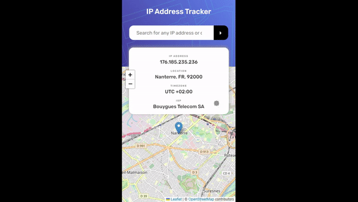

# IP Address Tracker
A SPA built with React JS, [IP Geolocation API](https://geo.ipify.org/) and [React Leaflet](https://react-leaflet.js.org/)

## Demo

### What I learned
While building this project I have:
* worked with multiple states, browser cache and async api requests
* discovered a new API to fetch information on IP address and how to localize it on the map component
* did a research on securing env variables when using VITE 

### Notes and points of improvements
This project is the solution to one of the [Frontend Mentor](https://www.frontendmentor.io/challenges/ip-address-tracker-I8-0yYAH0/hub) challenges it **does not** require a backend layer.  
But I need to mention that this time I had to work with API key which I have stored locally as an environment variable and this has risen a question on _data security_ and its exposure.  
Fortunately, I have found a package [dotenv](https://www.npmjs.com/package/dotenv) which provides an elegant way to store and invoke env variables. However, this is not a completely secure solution since it works well only for the development stage, since api key with VITE_ prefix is still exposed on the project build stage. If we don't use VITE_ prefix, we can’t send api requests.  
In my opinion, if you are using VITE as a build tool, for production you should consider securing your ENVs with proxy (for example, using another layer with next / express framework to fetch api key instead of using dotenv workaround).

### Useful links
- [An important article on react state](https://react.dev/learn/thinking-in-react)
- [IP Geolocation API](https://geo.ipify.org/)
- [Env variables and DOTENV file VITE](https://devzibah.hashnode.dev/using-a-dotenv-file-to-store-and-use-api-keys-in-a-vite-built-react-app)